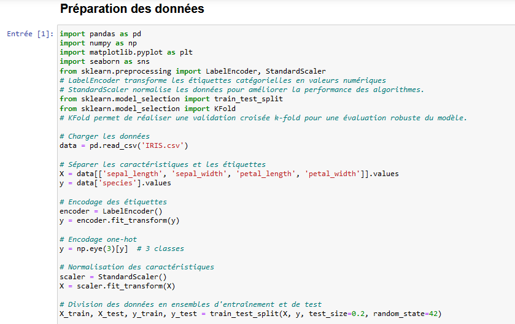
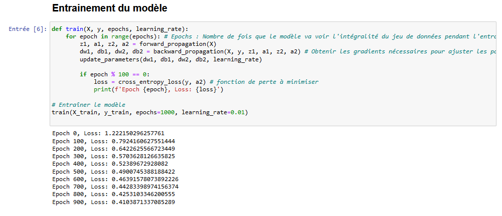
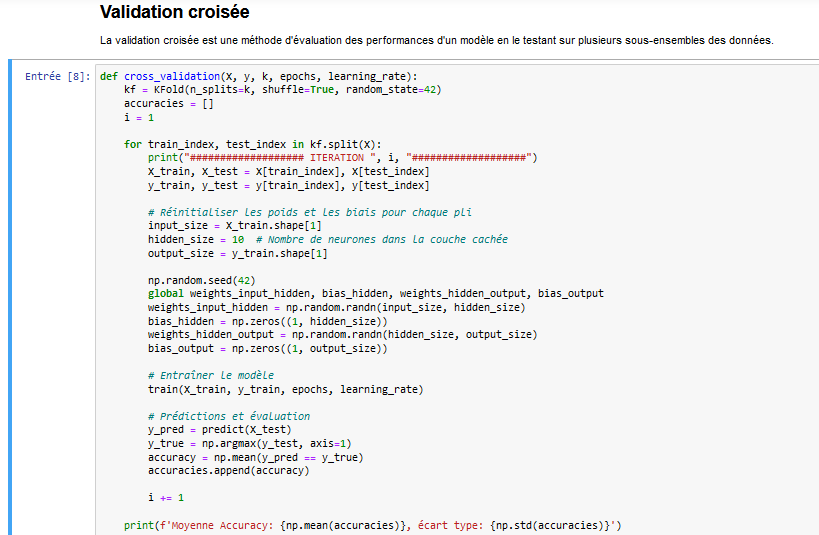

# Construction d'un Réseau de Neurones pour la Classification des Espèces Iris

## Source du Dataset

Le dataset utilisé dans ce projet est le jeu de données [Iris](https://www.kaggle.com/datasets/arshid/iris-flower-dataset), qui contient des informations sur trois espèces de fleurs Iris.

## Objectif

L'objectif de ce projet est de construire un réseau de neurones 'from scratch' pour classifier les espèces de fleurs Iris. En construisant ce réseau de neurones sans utiliser de frameworks spécialisés, on vise à comprendre en profondeur les mécanismes et les mathématiques sous-jacents au fonctionnement des réseaux de neurones.

## Description du Jeu de Données

Le jeu de données Iris comprend les variables suivantes :

- **sepal_length** : La longueur du sépale en cm.
- **sepal_width** : La largeur du sépale en cm.
- **petal_length** : La longueur du pétale en cm.
- **petal_width** : La largeur du pétale en cm.
- **species** : L'espèce de la fleur (Iris-setosa, Iris-versicolor, Iris-virginica).

## Préparation des Données

### Étapes de Préparation

1. **Chargement des données** : Importation des données à partir d'un fichier CSV.
2. **Séparation des caractéristiques et des étiquettes** : Extraction des variables de caractéristiques (longueur et largeur des sépales et pétales) et des étiquettes de classe (espèces).
3. **Encodage des étiquettes** : Conversion des étiquettes textuelles en valeurs numériques.
4. **Normalisation des caractéristiques** : Standardisation des caractéristiques pour avoir une moyenne de 0 et une variance de 1.
5. **Division des données en ensembles d'entraînement et de test** : Répartition des données pour l'entraînement et l'évaluation du modèle.

## Construction du Réseau de Neurones

### Architecture du Modèle

1. **Couche d'entrée** : Reçoit les caractéristiques des fleurs (4 neurones).
2. **Couche cachée** : Une couche cachée avec 10 neurones utilisant la fonction d'activation sigmoid.
3. **Couche de sortie** : Trois neurones pour les trois classes d'espèces utilisant la fonction d'activation softmax.

### Propagation Avant

La propagation avant calcule les sorties du réseau en passant les entrées à travers chaque couche du réseau de neurones, en appliquant les fonctions d'activation appropriées.

### Propagation Arrière

La propagation arrière ajuste les poids et les biais du réseau en fonction des erreurs de prédiction calculées par rapport aux étiquettes réelles. Cela implique le calcul du gradient de la fonction de perte par rapport aux poids, et l'application de la descente de gradient pour minimiser cette perte.

### Mise à Jour des Paramètres

Les poids et les biais sont mis à jour après chaque itération d'entraînement pour réduire l'erreur de prédiction du réseau. Cela se fait en utilisant un taux d'apprentissage spécifié.

## Entraînement du Modèle

Le modèle est entraîné sur plusieurs époques, durant lesquelles il ajuste continuellement ses paramètres pour améliorer ses prédictions. À chaque itération, la perte (erreur) est calculée pour surveiller la performance du modèle.

## Validation Croisée

Pour évaluer la robustesse du modèle, une validation croisée k-fold est effectuée. Cette technique divise les données en k sous-ensembles, et le modèle est entraîné et testé k fois, chaque fois en utilisant un sous-ensemble différent pour les tests et les autres pour l'entraînement.

## Évaluation du Modèle

Les performances du modèle sont évaluées en termes de précision sur l'ensemble de test. La précision est calculée comme le pourcentage de prédictions correctes sur l'ensemble de test.

## Visualisation des Résultats

Les résultats de la validation croisée sont visualisés sous forme d'histogrammes pour montrer la distribution des précisions obtenues à chaque itération. Une courbe normale peut également être tracée pour illustrer la distribution des précisions.

## Captures d'écran

